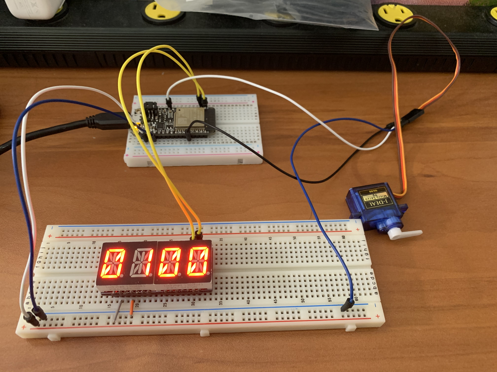
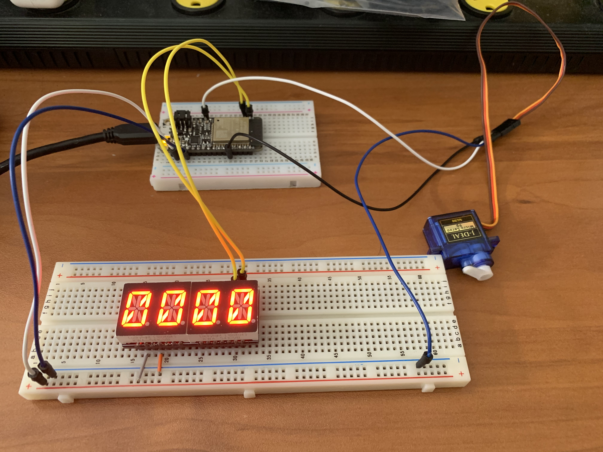

# Servo Fish Feeder Project

Authors: Shaivya Gupta, Tony Faller, Roger Ramesh

Date: 2020-09-21
-----

## Summary

For this project, our group needed to design a program and hardware that can display a countdown timer in hours and minutes (or minutes and second when the time gets low enough) till the next feeding time for fish.  Once the counter goes down all the way, a servo motor is triggered and the servo rotates back and forth three times.  This servo is connected to the feeder, and its shaking will cause the food to drop out for the fish.

## Self-Assessment

### Objective Criteria
| Objective Criterion | Rating | Max Value  | 
|---------------------------------------------|:-----------:|:---------:|
| The servo does not chatter and spins back and forth three times.  | 1 |  1     | 
| The alphanumeric display indicates time in hours/minutes or minutes/seconds.  | 1 |  1     | 
| No time loss when counting down | 1 |  1     | 
| Food dispensed at specific times | 1 |  1     | 
| Demo delivered in time  | 1 |  1     | 
| N/A  | N/A |  N/A     | 
| Investigative Question Responded to | 1 |  1     | 

The investigative question is on this report.

### Qualitative Criteria

| Qualitative Criterion | Rating | Max Value  | 
|---------------------------------------------|:-----------:|:---------:|
| Quality of solution                            | 5 |  5     | 
| Quality of report.md including use of graphics | 3 |  3     | 
| Quality of code reporting                      | 2 |  3     | 
| Quality of video presentation                  | 3 |  3     | 

Our solution was very solid, it met all the requirements and fully utilized the robustness of the RTOS system. We created a task for both pieces of hardware (display and servo) as well as for the timer. After lots of backbreaking work, we finally understood how the suspend and resume functionality worked (created TaskHandlers and figured out the flow of our code to understand when exactly to pause a task and resume it), and the result was hardware that isn't synchronous but maintains the illusion of it being synchronous. We initially faced issues like the timer jumping too quickly every 3-4 seconds, or, when the servo reset, the timer would lose a few seconds. This forced us to really scrutinize RTOS, and we finally were successful.

The code reporting was pretty average as well, it got the job done and it explains the code.  However, we could also improve on our git branching and merging. We branched, but we have only worked off that branch before merging back to master.  That is, until the end, when working on perfecting the RTOS concept.  Our comments and readmes are also pretty average.

## Solution Design

This project utilized our understanding of our previous skills, as we used the i2c alphanumeric display to display the timer in real time as feeding time approaches.  It is connected to the Huzzah32 board, which provides it 3.3V, ground, and the SCL and SDA pins with their included pull-up resistors.

The servo works through Pulse Width Modulation (PWM), and changing the pulse width through code is how we manipulate the angle of the servo, triggering it to spin back and forth.  It is powered by the Huzzah32, and it is plugged to a GPIO pin as an output device.

Finally, both the servo and the alphanumeric display are synchronized via the RTOS, and the code includes internal timer functionality via hardware clock.  The RTOS is constantly tracking the timer through the timer task, and a flag is triggered every second.  Upon trigger, a global counter variable is decremented, and the alphanumeric function is called to update the display.

When the counter decrements all the way to 0, the display is decremented to 0 as well. Then the display and timer tasks are suspended as the servo function is called to rotate the servo back and forth 3 times.  Upon completion, the other two tasks are no longer suspended, and the counter/display are allowed to reset.

## Investigative Question

Question: What approach can you use to make setting the time interval dynamic (not hard coded)? Elaborate.

Currently the time interval is a hardcoded defined constant in our program. We could make it a dynamic variable instead, and this can be done in multiple ways.

First, we know that the value will now be a variable, so we can assign a variable to accept an input. Secondly, we can use a button as a piece of hardware that can set a flag, letting the program know that the user is about to enter a new time entry as an input.  However, this does not yet interrupt the timer currently running.  Then, using the UART driver (so this example assumes the hardware is connected to a computer), the user can then input a time. The console will first ask for hours, then minutes, then maybe even seconds. Each of these inputs are read (and error checked), and these values are assigned to the variables for time. Once all are entered, the hardware resets with the new countdown timer. If the user presses the button again, however, the flag is removed and the counter continues as it was before.

    
## Sketches and Photos

  

Servo on reset

Servo in transit

## Supporting Artifacts
- [Link to video demo](https://drive.google.com/file/d/1GsIkJbbE8_eYvR9bQFH1B3xoGGw2KLnc/view?usp=sharing). Not to exceed 120s

## Modules, Tools, Source Used Including Attribution

All modules used are either our own or taken straight from already provided git repos.

[Example code for i2c_display](https://github.com/BU-EC444/code-examples/tree/master/i2c-display/main)

[The alphafonttable](https://github.com/adafruit/Adafruit_LED_Backpack/blob/master/Adafruit_LEDBackpack.cpp)

[ESP example code for servos](https://github.com/espressif/esp-idf/tree/master/examples/peripherals/mcpwm/mcpwm_servo_control)

[ESP-IDF Github Timer Example](https://github.com/espressif/esp-idf/tree/17ac4ba/examples/peripherals/timer_group)

## References

[Pinout Huzzah32](https://learn.adafruit.com/adafruit-huzzah32-esp32-feather/pinouts)

[Servo wiring](https://www.instructables.com/id/Interfacing-Servo-Motor-With-ESP32/)

[Timer Interrupts Brief](http://whizzer.bu.edu/briefs/design-patterns/dp-timer)

[Pulse Width Modulation](http://whizzer.bu.edu/briefs/design-patterns/dp-pwm)

