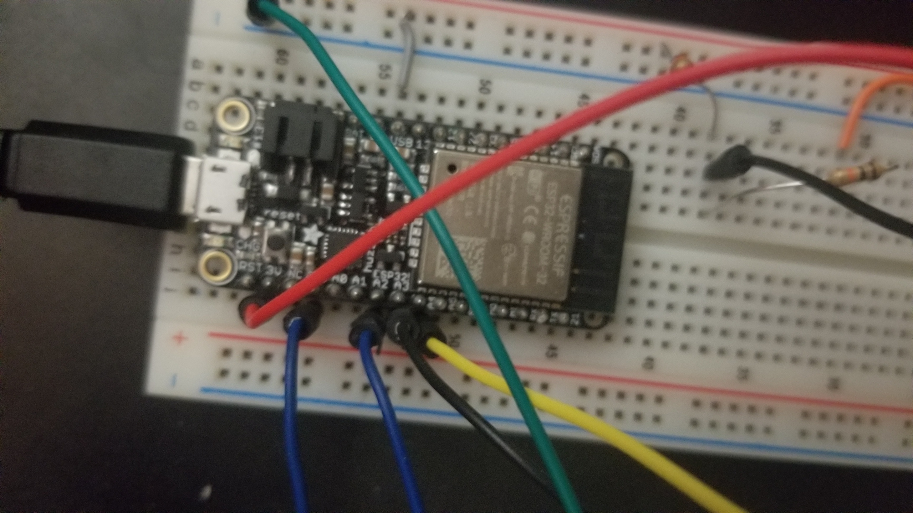
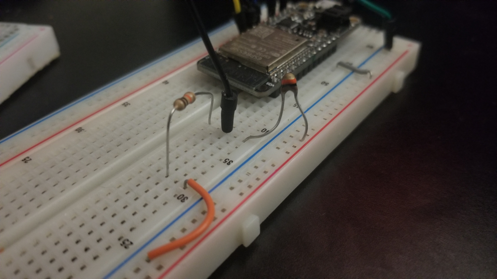
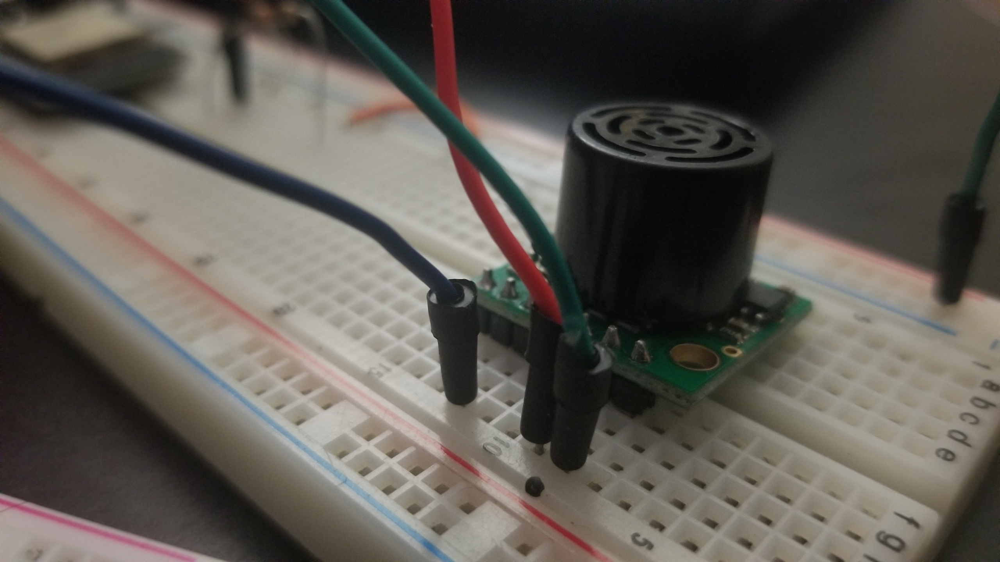
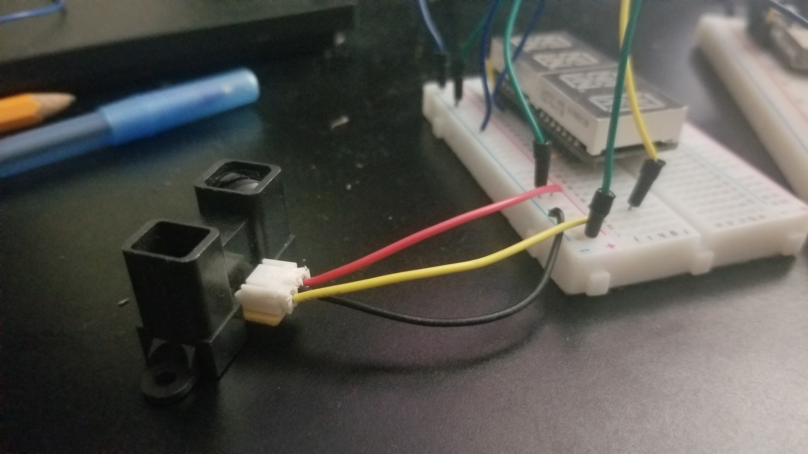
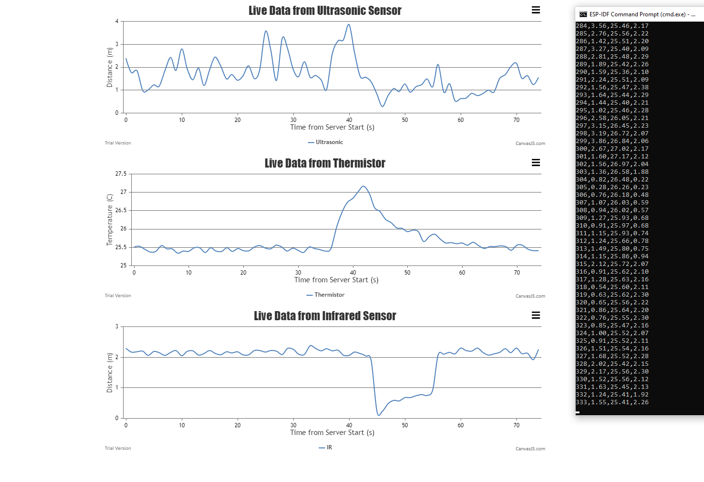

# Tactile Internet Project
Authors: Roger Ramesh, Tony Faller, Shaivya Gupta

Date: 2020-10-08
-----

## Summary
For this project, our team designed software and hardware to take in data from the thermistor, IR range finder, and ultrasonic sensor in real time. Data from each sensor is read every second and is dynamically displayed via multiple CanvasJS graphs. 

## Self-Assessment

### Objective Criteria

| Objective Criterion | Rating | Max Value  | 
|---------------------------------------------|:-----------:|:---------:|
| Periodic reporting of ultrasonic range in m | 1 |  1     | 
| Periodic reporting of IR range in m | 1 |  1     | 
| Periodic reporting of temperature in C | 1 |  1     | 
| Results displayed at host as text | 1 |  1     | 
| Results graphed at host continuously based on reporting period| 1 |  1     | 
| Demo delivered at scheduled time and report submitted in team folder with all required components | 1 |  1     | 
| Investigative question response | 1 |  1     | 

### Qualitative Criteria

| Qualitative Criterion | Rating | Max Value  | 
|---------------------------------------------|:-----------:|:---------:|
| Quality of solution | 5 |  5     | 
| Quality of report.md including use of graphics | 3 |  3     | 
| Quality of code reporting | 3 |  3     | 
| Quality of video presentation | 3 |  3     | 

Our solution meets the requirements of this project by ensuring that data is received from all sensors and displayed in real time. The code for reading the sensors is assembled in a task, the delay of which is triggered by a timer event. The code when executed is sequential, but the data being sent to the server is plotted without any meaningful delay. 

The objective criterion "Results displayed at host as text" was ambiguous towards whether this meant on the NodeJS console or on the same web page as the graphs; we interpreted the former. As such, as the server runs, the data being appended to the CSV file is also printed on the console. 

The report has photos of the overall setup of the sensors on the breadboard connected to the ESP32. The video presentation gives an indepth breakdown of the project overall summary, sensors being used, and libraries being used to display the graph. It also will highlight the backend and frontend development that was needed for the entire module to function. 

We used branching, merging, and readme's for this quest, particularly divided between the front-end graphing and the back-end sensor reading. This is reflected on our Team 7 repo. We also commented the code effectively and efficiently, leading to little to no confusion between teammates during development.

## Solution Design
The project utilized the skills leading up to the quest. Specifically, it utilized the thermistor, ultrasonic, IR Range finder, Node.js, and CanvasJS skills. 

The thermistor, ultrasonic, and IR range finder sensor readings are assembled in a task. The task involves using the the raw data being pulled from each of the sensors. This data is multisampled, meaning a number of readings are taken and the readings are average. The data is then stored in variables which are plugged into different formulas so they can be converted into engineering units as data for the graphs. 

A NodeJS script is used to create a server to receive data from the ESP32 via serialport. The script creates a CSV file (or overwrites a preexisting one) and appends the data from the ESP32. The CSV data is then piped to and parsed in the HTML file and stored in three arrays corresponding to the sensor types. CanvasJS and jQuery functions are then used to plot as the data as it updates each second. The graphs are revisualized every 500ms to allow for synchronicity.

We faced a number of challenges in creating this solution, most notably with the ultrasonic sensor. At first, it behaved very unexpectedly and gave wildly inaccurate and imprecise results; after many consultations with the EC444 teaching staff, however, we were able to smooth out sensor readings to a certain extent. It should be noted that a possible source of jitter is variations in the ESP32 output voltage. It was suggested multiple times that we connect a capacitor to the voltage source, but due to hardware restrictions, this was unable to be done. 

## Investigative Question

Question: Tabulate and compare the accuracy and speed of the IR and ultrasonic sensors. Which one would you prefer to use to support driving a robotic car?

We believe that IR sensors would be preferred for designing a robotic car. Ultrasonic sensors rely on soundwaves to measure the distance between an object and a sensor, while IR uses infrared light emitted to and reflected from objects to determine how far away it is. Cars should use IR sensors because they are far more accurate and precise - according to our tests, the ultrasonic sensor was very prone to jittering, and IR results were much more stable. This is shown in the demo video and in the pictures below.

## Sketches and Photos

Though the wire colors have some overlap, this will give some general idea of the setup in relation to the ESP board.

- The red wire is 3.3 V and connects to Vcc of the Ultrasonic.

- The blue wire next to the red wire is Ground and is used to complete all circuits with relative ground.

- The small gray wire on the top (board line 54) is 5 V and connects to IR and Thermistor.

- The 3 wires next to each other are the ADC channels (A2, A3, A4). A2 connects to the Ultrasonic (Blue wire).  A3 connects to the thermistor reader (Black wire).  A4 connects to the Infrared (Yellow wire).

 

The thermistor connects to the 5V gray wire. Between the Thermistor and 10K Resistor is the black ADC sensor wire. Finally the 10k resistor is connected to ground.

 

The ultrasonic sensor receives the 3.3V(Red wire) and sends voltage output to ADC2 (Blue wire).  The sensor is also grounded (green wire).

 

The infrared sensor receives the 5V and is connected to the red wire on the IR sensor. The black wire on the sensor is connected to ground, and the yellow wire is connected to the ADC sensor.

 

Using CanvasJS and JS, we output the CSV data to console as well as display onto a dynamic graph.  The graphs automatically rescale and give a general sense of a range of values.

- The ultrasonic sensor is definitely quite finnicky even with the multisample averaging, though it is better than it once was. The wave signal detection technology is not the most stable.

- The thermistor works quite well with some minor bouncing over a small range of temperatures.  It responds well to touch as indicated by value increase.

- The infrared works quite well, too, with its 2 m detection of the ceiling. When an object comes close, it rapidly moves down and just as quickly makes its way back up once the object is gone.

## Supporting Artifacts
- [Link to video demo](https://drive.google.com/file/d/1cM7lX_a9NIYgwu8XoFxMH-NN1LHC15tH/view?usp=sharing).

## Modules, Tools, Source Used Including Attribution
CanvasJS and NodeJS Resources
1. [Dynamic Multi-Series Chart](https://canvasjs.com/javascript-charts/dynamic-live-multi-series-chart/)
2. [jQuery setTimeout() Function](https://www.w3schools.com/jsref/met_win_settimeout.asp)
3. [NodeJS File System](https://www.w3schools.com/nodejs/nodejs_filesystem.asp)
4. [NodeJS serialport](https://serialport.io/docs/api-serialport)
5. [NodeJS express](https://expressjs.com/en/starter/hello-world.html)

esp32 Resources
1. [ADC Code Example](https://github.com/espressif/esp-idf/tree/39f090a4f1dee4e325f8109d880bf3627034d839/examples/peripherals/adc)
2. [Timer Task](https://github.com/BU-EC444/code-examples/tree/master/timer-example)

## References
[Thermistor Datasheet](http://eaa.net.au/PDF/Hitech/MF52type.pdf)

[Ultrasonic Range Finder Datasheet](https://www.maxbotix.com/documents/HRLV-MaxSonar-EZ_Datasheet.pdf)

[IR Rangefinder Datasheet](https://www.sparkfun.com/datasheets/Sensors/Infrared/gp2y0a02yk_e.pdf)

-----

