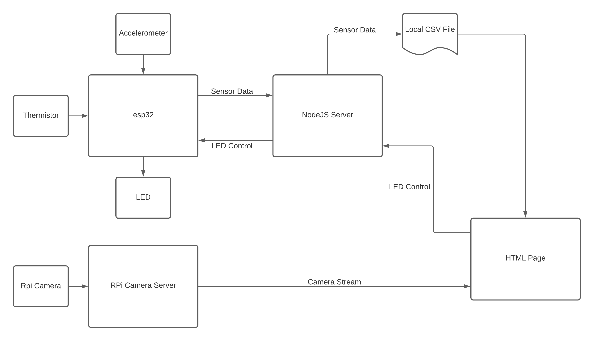

# Hurricane Box
Authors: Shaivya Gupta, Roger Ramesh, Tony Faller

Date: 2020-10-23
-----

## Summary
For this project, our team designed software to take in data from the thermistor and accelerometer in real time. Data from each sensor is dynamically graphed via multiple fixed-window CanvasJS graphs. A hyperlink on our HTML page leads to a livestream from the Raspberry Pi camera, and a button allows for on/off toggling of an LED. Dynamic DNS and port forwarding are used to allow for remote access from a different IP network.

## Self-Assessment

### Objective Criteria

| Objective Criterion | Rating | Max Value  | 
|---------------------------------------------|:-----------:|:---------:|
| ESP32 measures acceleration, temperature | 1 |  1     | 
| Displays real-time data (temperature, vibration) at remote client via portal using separate IP network | 1 |  1     | 
| Controls LED on box from remote client via portal | 1 |  1     | 
| Sources web cam video into remote client | 1 |  1     | 
| ESP32 and Rpi are connected wirelessly to router; ESP32 sensor data are delivered to local node server | 1 |  1     | 
| Demo delivered at schedule time and report submitted in team folder with all required components | 1  |  1     | 
| Investigative question response | 1 |  1     | 

### Qualitative Criteria

| Qualitative Criterion | Rating | Max Value  | 
|---------------------------------------------|:-----------:|:---------:|
| Quality of solution | 5 |  5     | 
| Quality of report.md including use of graphics | 3 |  3     | 
| Quality of code reporting | 3 |  3     | 
| Quality of video presentation | 3 |  3     | 

Our solution meets the requirements of this project by ensuring that data is received from all sensors and displayed in real time. The ESP32 utilizes a UDP server written with NodeJS, which allows for wireless data transfer from client to server. Then, the server sends the data over to an HTML file, which parses and displays the data in real time. Using Dynamic DNS and port forwarding, the locally-run server is also accessible remotely.

## Solution Design
The project utilized previous code from the skills and Quests. Specifically, it utilized our thermistor and visualization code from Quest 2 and the accelerometer code from Skill 23. 

The thermistor and accelerometer readings are coded as multi-sampled functions. These functions are then called in a task that communicates with the UDP server via local wifi and writes their return values into a datagram payload sent to the server. 

NodeJS was used to create a UDP server to receive data from the ESP32 and to create an HTML server to host our web page. Just as in the last quest, the server creates or overwrites a local CSV file and pipes the data over to HTML via AJAX, where the data is parsed and visualized in real time with CanvasJS. 

The same ideas are used in the opposite direction to remotely control the LED. An AJAX GET request brings data from the HTML page to the NodeJS server, and the server then sends a "Toggle!" message back to the ESP32 via UDP.

For this Quest, we added a fixed-window size of about 60 seconds to our graphs, so if the server is left running for a large amount of time, the visualizations do not become illegibly squished.

## Investigative Question
Question: What are steps you can take to make your device and system low power?

One way to reduce power consumption is to only activate the ESP32 and its peripherals when the web page is accessed. At all other times, the device would be "asleep," or in a low-power, non-recording state. Similarly, another option would be to only activate the ESP32 when its accelerometer detects movement. A third, slightly less impactful option would be to use high-resistance resistors in our sensor circuits, reducing current and thereby power.

The Raspberry Pi is also a source of high power consumption, but this could be remedied by using the ESP32's 5V output to supply Pi power. It could be possible to use GPIO to short the voltage supply circuit until it is time to turn on the Pi camera, at which point the short would be removed and power would be supplied to the camera. This could cause some delay between initial access of the web page and the access of the camera, however. 

## Sketches and Photos

  

## Supporting Artifacts
- [Link to video demo](https://drive.google.com/file/d/1ptWVvMHg8mPdJVBtEE6VrjwUlXUBbVvc/view?usp=sharing). Video Hurricane Box

## Modules, Tools, Source Used Including Attribution

ESP32 Resources
1. [ADC Code Example](https://github.com/espressif/esp-idf/tree/39f090a4f1dee4e325f8109d880bf3627034d839/examples/peripherals/adc)
2. [i2c Code Example](https://github.com/BU-EC444/code-examples/tree/master/i2c-display)
3. [Accelerometer Base Code](https://github.com/BU-EC444/code-examples/tree/master/i2c-accel)
4. [UDP Client Example](https://github.com/espressif/esp-idf/tree/master/examples/protocols/sockets/udp_client)
5. [Thermistor Code Source](https://github.com/BU-EC444/Team7-Ramesh-Gupta-Faller/tree/master/quest-2)

Raspberry Pi Resources
1. [Livestream Video Tutorial](https://www.hackster.io/narender-singh/portable-video-streaming-camera-with-raspberry-pi-zero-w-dc22fd)

NodeJS Resources
1. [File Creation](https://www.w3schools.com/nodejs/nodejs_filesystem.asp)
2. [UDP Server Creation](http://whizzer.bu.edu/briefs/design-patterns/dp-sockets)
3. [Pipe Data from Server to HTML](https://expressjs.com/en/starter/hello-world.html)
4. [Pipe Data from HTML to Server](https://www.quora.com/What-is-the-simplest-way-to-make-an-HTML-button-communicate-with-a-Node-js-server)

CanvasJS Resources
1. [Fixed Graph Window Size](https://canvasjs.com/javascript-charts/dynamic-spline-chart/)
2. [Dynamic Multi-Series Chart](https://canvasjs.com/javascript-charts/dynamic-live-multi-series-chart/)

## References
[Accelerometer](https://wiki.dfrobot.com/How_to_Use_a_Three-Axis_Accelerometer_for_Tilt_Sensing)

-----

