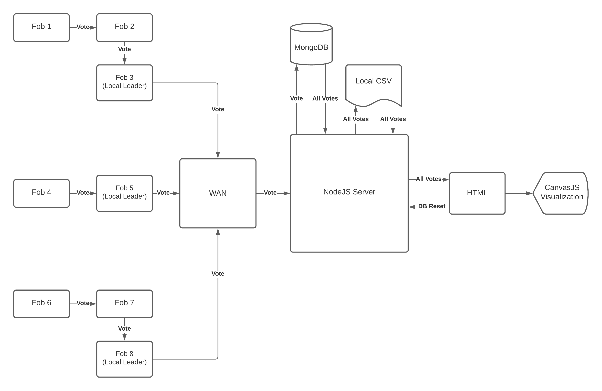

# E-Voting v2
Authors: Tony Faller, Shaivya Gupta, Roger Ramesh

Date: 2020-11-13
-----

## Summary
For Quest 4, our team was tasked with designing an election system using infrared sensor FOBs. The quest stacked on top of the skills, and we needed to use some moderately complex hardware incorporating multiple ESP32s.  The FOBs would communicate via IR sensors as well as through Wi-Fi on a local network in order to, first, select a local leader, and, second, to count votes (between red, green, and blue).  Each team member had his own local election, but all elections would pipe to the same server for a "national" election and a total tally.

## Self-Assessment

### Objective Criteria

| Objective Criterion | Rating | Max Value  | 
|---------------------------------------------|:-----------:|:---------:|
| Fob performs IR NFC data exchange of vote to another fob | 1 |  1     | 
| Receiving fob communicates vote to Poll Leader via network communication | 1 |  1     | 
| Poll Leader is replaced if fails | 1 |  1     | 
| Poll Leader reports votes to server database | 1 |  1     | 
| Portal allows query to database to show actual vote counts per candidate | 1 |  1     | 
| Operates over multiple sites or with all available fobs (Up to 9) | 1 |  1     | 
| Investigative Question Response | 1 |  1     | 

### Qualitative Criteria

| Qualitative Criterion | Rating | Max Value  | 
|---------------------------------------------|:-----------:|:---------:|
| Quality of solution | 5 |  5     | 
| Quality of report.md including use of graphics | 3 |  3     | 
| Quality of code reporting | 3 |  3     | 
| Quality of video presentation | 3 |  3     | 

## Solution Design
The sketch below provides a detailed flowchart of the entire process. We can consider a few stages to the code. First, we needed to create unique IDs for each FOB, so each FOB ran its own version of the code that is almost identical, but with minor differences.  Namely, each FOB had a unique ID (1-8). Additionally, since each team member was running his own local election, the FOBs would only be communicating with each other on a local network, so the code reflects that. Each team member's assigned FOB numbers only contain their local ESP IP Addresses.

With this setup, each local election needs to choose its local FOB leader, and this is done using UDP, where the ESPs communicate with each other until it determines a clear winner: the ESP with the highest ID Number locally. Then a heartbeat is periodically sent out by the leader to each local FOB to communicate that it's still online.  If this periodic check fails (I.E. the FOB falls off the network), a re-election is in order and the next highest ID # becomes the leader. 

After the leader election comes the candidate (color) election, in which each FOB votes for a color via button push when their desired LED color is lit up. Whenever a button is pressed, a vote is added for the corresponding color that is lit up. The button push transmits the selection of a FOB to another FOB's IR receiver, and that FOB forwards the message to the leader, who then sends the data over the network to the server (via port forwarding). If, however, a site only has two IR-enabled fobs and one goes down, voting can no longer happen at that site.

When the network receives the data, it immediately writes the new data to MongoDB. It then queries and receives the updated entirety of the database and pushes it to a CSV file to be read, parsed, and graphed via CanvasJS in HTML. A plaintext log of all votes are also listed on the webpage.

Finally, to account for an election reset, the HTML page uses a button which, upon being triggered, sends a signal back to the server to clear the CSV and database. It then reinitializes the database with a "reset" entry, which will not be used by anything but helps set up the server again.

## Investigative Question:

List 5 different ways the system can be hacked: 

- Absence of authentication:  As the client makes no authentication request with the server, any attacker can initiate a communication session with the server as long as the server is accessible over network (via WiFi or Internet).
- Unreliable communication because of UDP:  UDP is used in network communication between client and server and it is stateless with no guaranteed message delivery.
- Cleartext communication risk:  As there is no encryption in place to communicate with the server, the commands set from the client can be intercepted, spoofed and modified by an attacker.
- Node.js server exposure to brute-force attacks: The Node.js service is vulnerable to many brute network related attacks as it can be flooded with messages to the UDP socket leading to server crash.
- Unsecure server with no firewall:  The server running the node.js server is not secured with firewall.  The server can be easily attacked as other ports on the server is still open.
- ESP32 runs untrusted code:  The ESP32 is not configured to use Secure Boot to run trusted and signed code.  As there is no secure boot, the attacker can run unverified malicious code on the ESP32.

Ways to protect and overcome hacks:

- Enable client and server authentication so that only authenticated requests are processed in the server.  Client may send a secret or certificate to verify its identity.
- Redesign the application to use TCP sockets so that the communication is reliable and it can make use of HTTP or MQTT protocols.
- Use SSL/TLS between client and server communication so that there is no opportunity for man-in-the-middle attacks.
- Configure node.js to use Web sockets with HTTPS or MQTT.
- Configure a firewall so that only required port is open for use from network.  All other ports must be closed.
- Enable “Secure Boot” in ESP32 so that the ESP32 executes trusted programs digitally signed by a known entity.  Use signing certificates to sign code before loading into ESP32.  Only signed code must be executed in ESP32.

## Sketches and Photos

  

  

 

## Supporting Artifacts
- [Link to video explanation](https://drive.google.com/file/d/1ZxM0XHVMFHkxMLNqcnZq0dhFZ99UxhmT/view?usp=sharing)
- [Link to video demo](https://drive.google.com/file/d/13zEddNsCukX56ZWsgNXLIQBJ01v35-nT/view?usp=sharing)

## Modules, Tools, Source Used Including Attribution

### ESP Sources
1. [UDP Client Example](https://github.com/espressif/esp-idf/tree/master/examples/protocols/sockets/udp_client)
2. [UDP Server Example](https://github.com/espressif/esp-idf/blob/master/examples/protocols/sockets/udp_server)
3. [IR Communication](https://github.com/BU-EC444/code-examples/tree/master/traffic-light-ir-example)

### JS Sources
1. [Remove Quotes from String with Regex](https://stackoverflow.com/questions/19156148/i-want-to-remove-double-quotes-from-a-string)
2. [Get Current Date as String](https://www.w3schools.com/jsref/jsref_tostring_date.asp)
3. [CanvasJS Bar Chart](https://canvasjs.com/html5-javascript-column-chart/)

## References

-----

