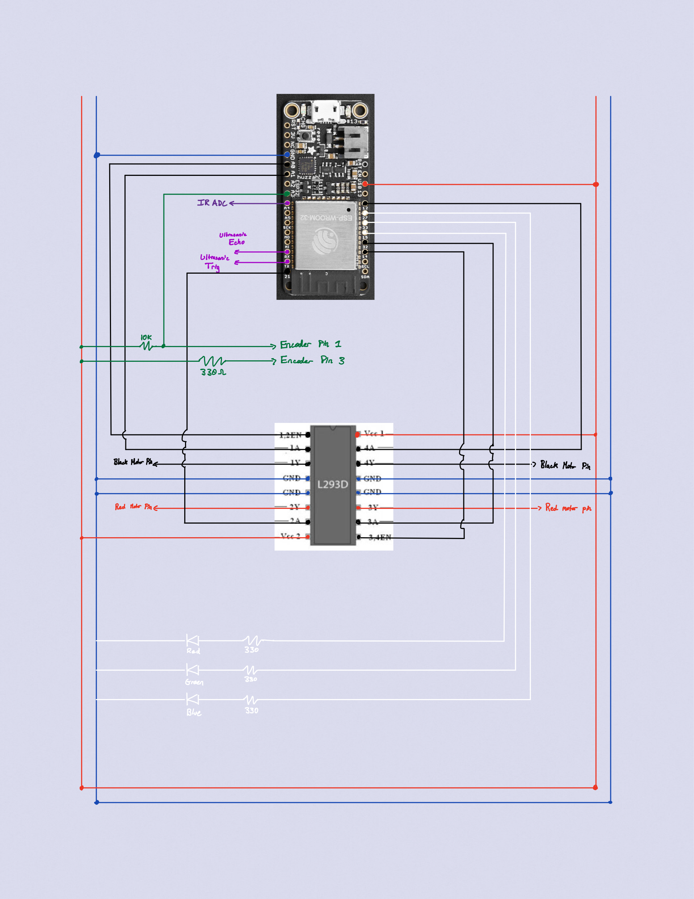
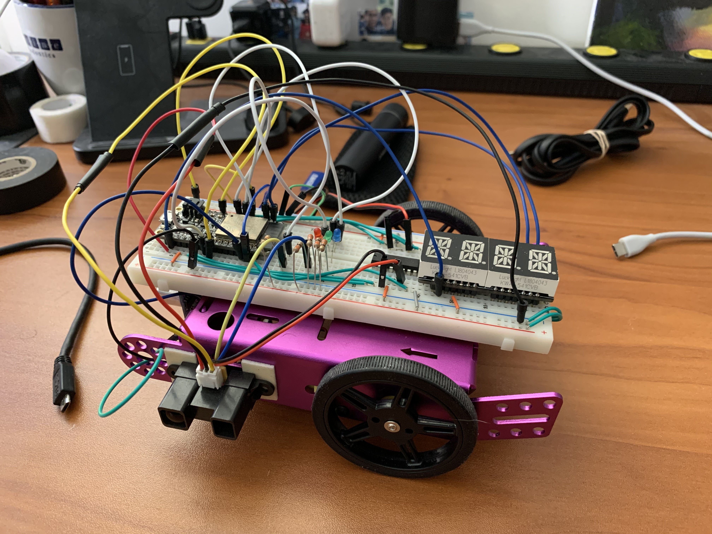

# Cruise Control
Authors: Shaivya Gupta, Anthony Faller, Roger Ramesh

Date: 2020-12-1
-----

## Teammate Contributions

Tony: 
1. Majority of report, including Sketches and Photos
2. `README.md` files in `esp-code` and `js-code`
3. ESP functions forward, stop @20cm, LED control, alphanumeric display, wireless capability including remote start/stop
4. UDP server implemented in NodeJS including front-end HTML page
5. General debugging assistance, brainstorming, and testing

Shaivya:
1. Extensive testing and debugging of the buggy. Optimization of code to reduce memory consumption errors.
2. Playing with the delay lengths, "wiggle" times, and duty cycles to maintain centering of car.
3. Implementing PID functionality to adjust the duty cycle according to speed calculations.
4. Managing the RTOS-esque juggling, ensuring that tasks work with syncronicity for the project.
5. Making the video to post onto Github report.

Roger:
1. Implemented intialization of IR Sensor and its formula for it to collect data

## Summary
For Quest 5, our team was tasked with assembling and designing firmware for an autonomous car. The Quest was very much an assembly of previous skills reaching as far back as Quest 3, but a number of criteria required new, out-of-the-box solutions. Our car uses a front-facing ultrasonic sensor to detect any oncoming collisions and a driver-side infrared sensor to maintain distance from a wall. An optical encoder is used to track car velocity, the magnitude of which is shown on an alphanumeric display. In addition, an HTML button controlled via NodeJS allows for a highest-priority start/stop button. 

To aid in debugging, a number of LEDs were employed to show which state the car was currently in. A lit green LED means the car is free to drive forward; a lit red LED means the car must stop; a lit blue LED means the car must adjust to be closer or farther from a wall; and the onboard LED signals if the HTML stop was activated. 

## Self-Assessment

### Objective Criteria

| Objective Criterion | Rating | Max Value  | 
|---------------------------------------------|:-----------:|:---------:|
| Controls steering to maintain center of course +/- 25cm for entire length | 1 |  1     | 
| Uses PID for speed control holding a fixed speed setpoint after startup and before slowdown [0.1-0.4 m/s] | 1 |  1     | 
| Stops within 20 cm of end without collision | 1 |  1     | 
| Start and stop instructions issued wirelessly from phone, laptop, or ESP | 1 |  1     | 
| Measures wheel speed or distance | 1 |  1     | 
| Uses alpha display to show current distance or speed | 1 |  1     | 
| Successfully traverses A-B in one go, no hits or nudges | 1 |  1     | 

### Qualitative Criteria

| Qualitative Criterion | Rating | Max Value  | 
|---------------------------------------------|:-----------:|:---------:|
| Quality of solution | 5 |  5     | 
| Quality of report.md including use of graphics | 3 |  3     | 
| Quality of code reporting | 3 |  3     | 
| Quality of video presentation | 3 |  3   | 

## Solution Design
The drawn schematic below details how each component of the car was wired to the esp32. The Quest can be broken down into discreet modules with global variables passed between them.

The first module considers the TT Motors. These motors were controlled via PWM on the EN pins of an H-bridge; a higher duty cycle translated to a higher speed, and a lower duty cycle translated to a lower speed. The default action for the motors was to move forward; however, upon the activation of certain "stop" or "turn" bits, the motors either stopped or turned left or right. A forward action causes the green LED to turn on.

The next module considers the front-facing ultrasonic sensor. This sensor continously scans the distance of objects in front of the car; if it detects an object at or closer than 20 centimeters, it raises a stop bit which stops the motors. This also causes the red LED to turn on.

The third module considers the optical encoder and alphanumeric display. The optical encoder tracks state changes of a pinwheel-type image attached to the inside of one of the car's wheels; the number of ticks detected within a certain timeframe are converted to velocity and displayed on the alphanumeric display. PID is used to maintain a speed between 0.1 m/s and 0.4 m/s, altering the motor duty cycle as appropriate. 

The next module considers wireless capability of the car. A basic UDP server implemented with NodeJS is used to communicate a web browser to the car, with a simple "Start/Stop" button displayed in HTML. When this button is pressed, a signal is sent back to the car to halt all activity. If it is pressed again, activity is allowed to resume. This button takes highest priority amongst all actions. This causes both the onboard LED and the red LED to turn on.

The last module considers the IR sensor to measure distance from a wall. A target of +/-25 cm from the center of the path is ideal; if the sensor measures large deviation from this, the car attempts to right itself by first turning one way then turning the other. This "wiggle" allows for the car to slowly return to center. When the car wiggles, the blue LED turns on.

## Investigative Question
How would you change your solution if you were asked to provide ‘adaptive’ cruise control?

A large assumption in this Quest was that our cars would be the only cars driving at any given time, allowing for certain assumptions to be made concerning things like crashes. Adaptive cruise control, however, requires other cars to be driving as well. The biggest change would likely be the addition of another, perhaps more sensitive front-facing sensor. This redundency is a required safety feature, for if one sensor fails, the other is still able to report accurate data. In addition, the data from both sensors could be averaged (or one could be prioritized over the other) to paint a more accurate picture of how far ahead another car actually is. 

Another change would be the addition of some sort of acceleration calculation, so our car could calculate how fast the car ahead of it is going. Adaptive cruise control attempts to match our car's speed to the other car's, so without this calculation, the control could not occur.

## Sketches and Photos

  

  

  

## Supporting Artifacts
- [Link to video demo](https://drive.google.com/file/d/16VMCLUlgS1luDn-OXif2ShrhOB5mj671/view?usp=sharing).

## Modules, Tools, Source Used Including Attribution
1. [espressif Brushed Motor Example Code](https://github.com/espressif/esp-idf/tree/11b444b8f493165eb4d93f44111669ee46be0327/examples/peripherals/mcpwm/mcpwm_brushed_dc_control)
2. [espressif RMT Examples](https://github.com/espressif/esp-idf/tree/178b122c145c19e94ac896197a3a4a9d379cd618/examples/peripherals/rmt)
3. [hcsr04 specific example](https://github.com/petemadsen/esp32/blob/master/hc-sr04/main/hcsr04.c)
4. [Example Code](https://learn.sparkfun.com/tutorials/qrd1114-optical-detector-hookup-guide#example-circuit)

## References
1. [Picture of Wired Car](http://whizzer.bu.edu/skills/assemble-car)
2. [Diagrams of H-bridge Wiring](http://whizzer.bu.edu/skills/motor)
3. [L293 Data Sheet](https://cdn-shop.adafruit.com/datasheets/l293d.pdf)
4. [H-bridge Tutorial](http://www.modularcircuits.com/blog/articles/h-bridge-secrets/h-bridges-the-basics/)
5. [espressif PWM Documentation](https://docs.espressif.com/projects/esp-idf/en/latest/esp32/api-reference/peripherals/mcpwm.html#_CPPv417mcpwm_duty_type_t)
6. [Ultrasonic Datasheet](https://cdn.sparkfun.com/assets/b/3/0/b/a/DGCH-RED_datasheet.pdf)
7. [RMT Driver Documentation](https://docs.espressif.com/projects/esp-idf/en/latest/esp32/api-reference/peripherals/rmt.html)
8. [Encoder Datasheet](https://www.sparkfun.com/datasheets/BOT/QRD1114.pdf)
9. [Wiring Guide](https://www.robotshop.com/community/forum/t/hooking-up-qrd1114-line-sensor/12952)
10. [PID Skill Page](http://whizzer.bu.edu/skills/pid)

-----

