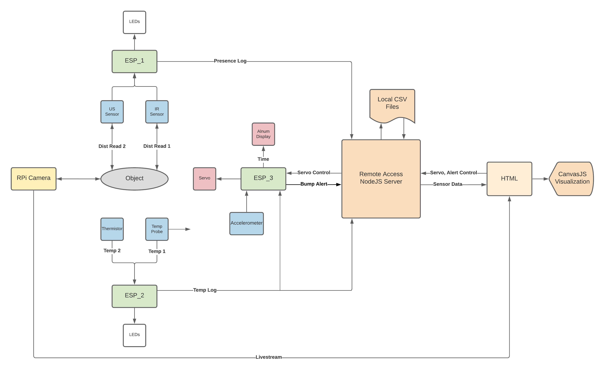
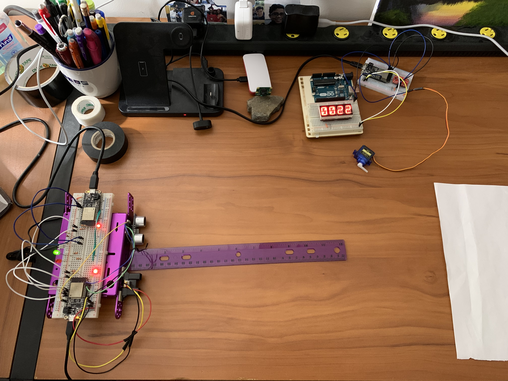

# Factory Temperature Control and Presence Detector

Authors: Shaivya Gupta, Tony Faller, Roger Ramesh

Date: 2020-12-07
-----

## Teammate Contributions
Tony: 
1. `README.MD` files in `esp-code` and `js-code`
2. All ESP_1 functionality
3. Repo reorganization for legibility
4. Commenting / reorganizing ESP_2 code for legibility
5. Wifi communication on all ESPs: ESP_X --> Server and ESP_2 --> ESP_3
6. NodeJS Server, including local CSV creation and piping
7. HTML Front-end, including alert clear, fan toggle, RPi Cam livestream, and CanvasJS Visualizations
8. Full system testing and debugging
9. Report Edits: diagram/picture, sources, ESP_X functions/behaviors

Roger Ramesh: 
1. All ESP_2 functionality (Thermistor, and Temperature Probe initializations)
2. Utilized formulas for temperature readings and established threshold temperature values to toggle LED alerts
3. Testing/Debugging ESP_1 and ESP_2
4. Full system testing (Node JS Server and data visualization for ESP_1 and ESP_2) and debugging 
5. Majority of Report

Shaivya:
1. Conceptualized project and wrote detailed outline for each task
2. Developed and edited the video
3. Wrote the code for ESP_3, implementing RTOS and setting flags for UDP
4. Adjusted ESP_2 code's thermistor formulae for accurate initial voltages and to stop infinite runsumming
5. Provided extensive assistance in testing and debugging hardware/code
6. General assistance in setting up backend for Tony to easily connect to frontend and receive necessary data
7. Assisted in flowchart development

## Summary
Using 3 ESPs, we have designed system to monitor a factory conveyor belt. ESP_1 utilizes an IR and Ultrasonic sensor to detect if an item is in an appropriate location, determined by presence in both sensors and being a certain distance away. ESP_2 samples the temperature using a thermistor and a thermal probe. ESP_3 uses a servo (pretend it's a fan) to cool the temperature in one of three cases: 1) Automatically every minute 2) Temperature is sensed by ESP_2 to be too hot 3) Remote control toggle. ESP_3 also has an accelerometer to measure whether or not the system is disturbed. The Raspberry Pi camera is used to give a live factory video. All sensor data is sent to a Node.js server via LAN Wifi and is visualized with CanvasJS; proximity logs from ESP_1 are listed with their timestamps, and accelerometer alerts from ESP_3 are shown as pop-ups. 

## Self-Assessment

### Objective Criteria

| Objective Criterion | Rating | Max Value  | 
|---------------------------------------------|:-----------:|:---------:|
| Achieves specified function | 1 |  1     | 
| At least 2 functional actuators | 1 |  1     | 
| At least 3 functional sensors | 1 |  1     | 
| At least 1 camera | 1 |  1     | 
| Demonstrates remote control and data presentation on separate network | 1 |  1     | 
| Has a time based function | 1 |  1     | 
| Multiple participating distributed ESP32s | 1 |  1     | 

### Qualitative Criteria

| Qualitative Criterion | Rating | Max Value  | 
|---------------------------------------------|:-----------:|:---------:|
| Quality of solution | 5 |  5     | 
| Quality of report.md including use of graphics | 3 |  3     | 
| Quality of code reporting | 3 |  3     | 
| Quality of video presentation | 3 |  3     | 

## Solution Design
The system is modular, meaning that each ESP had its own functions and tasks. Data is passed from each ESP to the server via local Wifi, and the server stores this data in separate CSVs (one for each ESP). This data is then piped to HTML, where it is visualized via CanvasJS.

ESP_1 used the Ultrasonic and IR sensors to detect if an object is in place and the correct distance away. Each sensor has its own green and red LEDs; if a sensor detects that the object is appropriately located, that sensor's green lights up. Otherwise, the red is lit. Once both sensors power their green LEDs, the board sends a log to the server, which is subsequently presented on the webpage. 

ESP_2 sampled the ambient temperature using a probe and a thermistor. Similar to ESP_1, this board had red and green LEDs. If both sensors read a "good" temperature, then the green LED is powered. If either sensed a temperature value above a certain threshold, the red LED is powered and a message is sent to ESP_3 to turn on the fan. The temperature readings are also sent to a Node.js server so the data can be visualized.

ESP_3 utilized the accelerometer to check if the system is nudged out of place. When a nudge is detected, the board sends an alert to the server which translates to a pop-up on the HTML page. ESP_3 also has a servo acting as a fan. This fan is turns on every minute, and the timer for this minute is displayed on an alphanumeric display. However, if ESP_2 senses a high temperature, the fan is also turned on. Additionally, the fan is remote controllable from the HTML page. 

The server is implemented in NodeJS, and it parses incoming messages based on the message's header. Three local CSVs are used to store data from each of the ESPs. The HTML page also has buttons to toggle the fan and clear accelerometer alerts, which send messages back to ESP_3.

The HTML page contains a livestream video from the Raspberry Pi, which provides a clear visual of the system.

## Sketches and Photos

  

Red: Actuators

Orange: Data Presentation

Yellow: Camera

Blue: Sensors

Green: Multiple ESPs

## Supporting Artifacts
- [Link to video demo](https://drive.google.com/file/d/1l2in6M1fjGOlSx8POKiQY9LjQhbykw6k/view?usp=sharing). Not to exceed 180s

## Modules, Tools, Source Used Including Attribution
ESP32 Resources
1. [Thermistor Code Source](https://github.com/BU-EC444/Team7-Ramesh-Gupta-Faller/tree/master/quest-2)
2. [ADC Code Example](https://github.com/espressif/esp-idf/tree/39f090a4f1dee4e325f8109d880bf3627034d839/examples/peripherals/adc)
3. [i2c Code Example](https://github.com/BU-EC444/code-examples/tree/master/i2c-display)
4. [Alphanumeric Display Code](https://github.com/BU-EC444/code-examples/tree/master/i2c-display)
5. [ASCII Table](https://github.com/adafruit/Adafruit_LED_Backpack/blob/master/Adafruit_LEDBackpack.cpp)
6. [Servo Control](https://github.com/espressif/esp-idf/tree/master/examples/peripherals/mcpwm/mcpwm_servo_control)
7. [Timer Tutorial](https://github.com/BU-EC444/code-examples/tree/master/timer-example)
8. [Accelerometer Base Code](https://github.com/BU-EC444/code-examples/tree/master/i2c-accel)
9. [UDP Client Example](https://github.com/espressif/esp-idf/tree/master/examples/protocols/sockets/udp_client)

Raspberry Pi Resources
1. [Livestream Video Tutorial](https://www.hackster.io/narender-singh/portable-video-streaming-camera-with-raspberry-pi-zero-w-dc22fd)

NodeJS Resources
1. [File Creation](https://www.w3schools.com/nodejs/nodejs_filesystem.asp)
2. [UDP Server Creation](http://whizzer.bu.edu/briefs/design-patterns/dp-sockets)
3. [CSV Piping](https://expressjs.com/en/starter/hello-world.html)
4. [HTML/NodeJS Communication](https://www.quora.com/What-is-the-simplest-way-to-make-an-HTML-button-communicate-with-a-Node-js-server)

CanvasJS Resources
1. [Fixed Graph Window Size](https://canvasjs.com/javascript-charts/dynamic-spline-chart/)
2. [Dynamic Multi-Series Chart](https://canvasjs.com/javascript-charts/dynamic-live-multi-series-chart/)
3. [Basic CSS Tutorial](https://html-online.com/articles/image-align-center/)

## References
Datasheet
1. [Accelerometer](https://wiki.dfrobot.com/How_to_Use_a_Three-Axis_Accelerometer_for_Tilt_Sensing)
2. [Thermistor Datasheet](http://eaa.net.au/PDF/Hitech/MF52type.pdf)
3. [Ultrasonic Range Finder Datasheet](https://www.maxbotix.com/documents/HRLV-MaxSonar-EZ_Datasheet.pdf)
4. [IR Rangefinder Datasheet](https://www.sparkfun.com/datasheets/Sensors/Infrared/gp2y0a02yk_e.pdf)

Port Forwarding
1. [No-IP Port Forwarding](https://www.raspberrypi.org/forums/viewtopic.php?t=134105)
2. [Google Wifi Port Forwarding](https://support.google.com/wifi/answer/6274503?hl=en)
3. [Google Port Forwarding with Second Router](https://support.google.com/googlenest/thread/33704178?hl=en)
4. [Google Wifi Doesn't Have DDNS](https://support.google.com/googlenest/thread/653373?hl=en)
5. [List of Available TCP/UDP Ports](https://en.wikipedia.org/wiki/List_of_TCP_and_UDP_port_numbers)
6. [Tool to Test if Port is Open](https://www.portchecktool.com/)
7. [Private vs Public IPs](https://whatismyipaddress.com/private-ip)

-----

